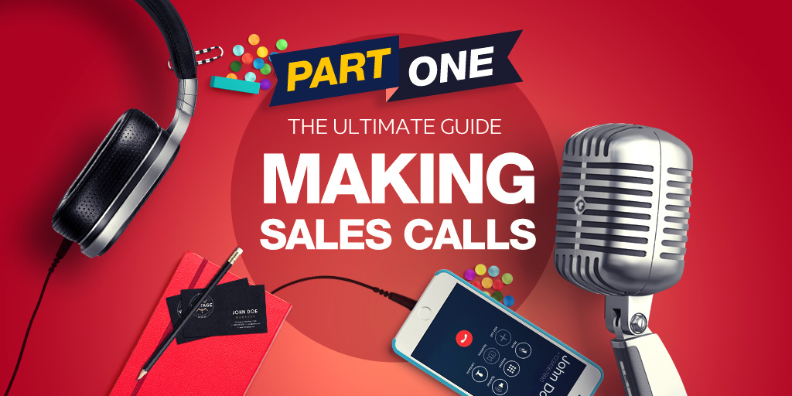

# 
 Cold Calls - Call Insurance 

# Problem Description
- We are looking at cold call results. Turns out, same salespeople called existing insurance customers up and tried to sell car insurance. 
- Outbound sales initiatives, while they used to be effective, are no longer the best route to convert leads to customers. Inbound marketing provides individuals with information about your company and allows them to develop their own opinions.

- Cold calling is considered to be an outbound strategy; it is company focused and assumes that every customer is a buyer. It can be transformed into an inbound strategy by calling with the intent of getting to know the customer.

# Goals

- The goal was to model the success of buying insurance using attributes that were known before the telemarketing call was executed
- A particular emphasis was given on feature engineering, as we considered an initial set.
